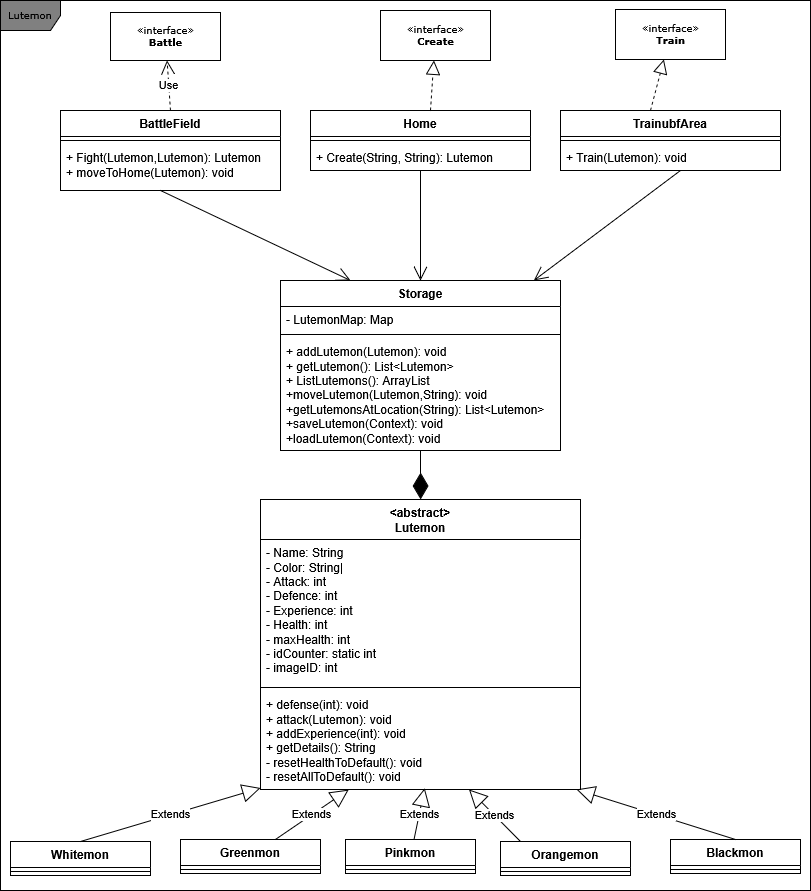

# Lutemons Game

## 📖 Description
This Android project allows users to create and collect Lutemons, each with unique attributes. Users can train them and control them in battle. The game supports saving/loading Lutemon data and visualizes each type of Lutemon with a unique image.

## 🧩 Features

### Lutemon Management
- Users can create different types of Lutemons, each with a unique image.
- Newly created Lutemons are placed in the "Home" area and displayed using a RecyclerView.
- Users can move selected Lutemons to training areas or battle arenas.
- Multiple Lutemons can be trained simultaneously. Only two Lutemons can participate in a battle.

### Training System
- Users can send multiple Lutemons to the training area, where they are displayed with a RecyclerView.
- Lutemons gain experience points when trained using a button.
- Experience increases a Lutemon’s attack power during battle, while the original attack attribute remains unchanged.

### Turn-Based Battle System
- Two Lutemons can be selected to battle, shown in a RecyclerView.
- Battles follow a turn-based system:
  1. One Lutemon attacks while the other defends.
  2. The battle progresses via a **Next Turn** button until one Lutemon’s health reaches zero.
  3. The winner gains an experience point.
  4. The loser is not removed from the game but loses all gained experience.
- Attack power is also affected by random factors to increase unpredictability.

### Lutemon Recovery
- When a Lutemon returns home, its health is fully restored.
- Experience points remain intact unless the Lutemon was defeated in battle, in which case it loses all experience.

### Data Storage & Loading
- All Lutemons are automatically saved to a local file.
- On app launch, saved Lutemons are loaded and displayed on the Home screen.

## 👥 Team Members & Responsibilities

| Team Member | Responsibilities                                                 |
|-------------|------------------------------------------------------------------|
| Iro Blanke  | Lutemon classes, Home, MainActivity, Create Lutemons, UI design |
| Jie Chang   | App structure, Battle, Training, Storage, Data saving/loading    |

## 🧱 Class Diagram



### Classes Included in the Diagram:
- `Lutemon`: Represents a creature with attributes such as attack, defense, color, health, image, and experience. The class includes methods for attacking and defending. Subclasses override the `reset()` method with different default values.
- `Storage`: Handles saving and loading of Lutemons. All Lutemons and their locations are managed in this class.
- `Home`: Creates lutemons with selected color and an input as the name.
- `BattleField`: Contains logic for battling two Lutemons.
- `Train`: Trains selected lutemons.

## 🚀 How to Run the App

1. Clone this repository:
   ```bash
   git clone https://github.com/yourusername/project-name.git
2. Open the project in Android Studio.
3. Sync Gradle and build the project.
4. Run the app on an emulator or connected device.
5. On launch, existing Lutemons (if saved) will be loaded automatically to the Home screen.
